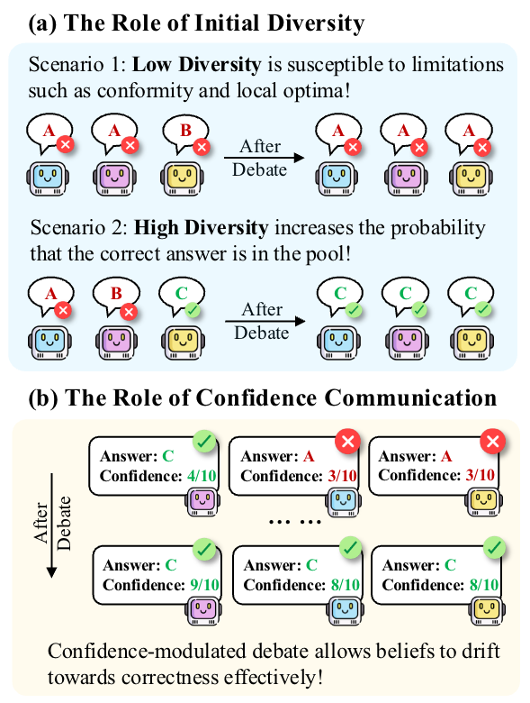

# DMAD: Demystifying Multi-Agent Debate

Official code for the paper:

> **Demystifying Multi-Agent Debate: The Role of Confidence and Diversity**
>
> 📄 [Paper (arXiv)](https://arxiv.org/abs/2601.19921)

<p align="center">
  
</p>

## Overview

Multi-agent debate (MAD) is a popular strategy for improving LLM reasoning, yet its benefits are often inconsistent.  We identify two root causes — **lack of diversity** in initial responses and **inability to leverage confidence** — and propose two lightweight interventions:

1. **Diversity-aware initialisation** — oversample *N* candidate responses, then greedily select the *K* most diverse ones (measured by embedding distance) to seed the debate.
2. **Confidence-modulated debate** — train agents via Group Relative Policy Optimisation (GRPO) to (i) *express* calibrated confidence scores and (ii) *perceive and use* others' confidence during belief updates.

Together, these consistently improve final accuracy and calibration across GSM8K, CommonsenseQA, HellaSwag, MMLU, and ARC-Challenge.

## Repository Structure

```
DMAD/
├── configs/                        # Example YAML configurations
│   ├── debate_llama.yaml           #   Debate with Llama-3.1-8B
│   ├── debate_qwen.yaml            #   Debate with Qwen2.5-7B
│   ├── grpo_confidence.yaml        #   Stage 1: confidence expression training
│   └── grpo_debate.yaml            #   Stage 2: confidence perception training
├── data/
│   ├── datasets.py                 # Public dataset loaders (GSM8K, CSQA, HellaSwag, MMLU, Arithmetic)
│   └── example_debate_data.json    # Example data format for grpo confidence perception training
├── inference/
│   ├── prompts.py                  # Prompt templates (initial & debate rounds)
│   ├── vllm_debate.py              # Vanilla multi-agent debate (vLLM)
│   └── vllm_debate_from_init.py    # Diversity-aware debate from pre-initialized outputs
├── training/
│   ├── grpo_confidence.py          # Stage 1: confidence expression calibration (GRPO + LoRA)
│   └── grpo_debate.py              # Stage 2: confidence perception & usage (GRPO + LoRA)
├── utils/
│   ├── __init__.py
│   ├── eval_utils.py               # Answer matching, XML parsing, majority vote
│   ├── data_utils.py               # Data loading, saving, batching, accuracy
│   └── calibration.py              # ECE, Brier score, AUROC
├── requirements.txt
└── README.md
```

## Installation

```bash
git clone https://github.com/<your-username>/DMAD.git
cd DMAD
pip install -r requirements.txt
```

> **Note:** vLLM requires a CUDA-capable GPU.  For training, we recommend ≥ 40 GB VRAM (e.g. A100).

## Quick Start

### 1. Prepare Data

Data should be a **CSV** with columns: `fold`, `dataset`, `question`, `label`.

```python
# Or load a public benchmark directly:
from data.datasets import load_gsm8k, load_csqa
questions, labels = load_gsm8k(split="test", data_size=300)
```

### 2. Run Vanilla Multi-Agent Debate

```bash
python inference/vllm_debate.py \
    --config configs/debate_llama.yaml \
    --input_csv data/debate_data.csv \
    --fold test \
    --seed 42
```

Key config parameters:
| Parameter | Description | Default |
|---|---|---|
| `debate.num_agents` | Number of debating agents (N) | 5 |
| `debate.num_rounds` | Number of debate rounds (T) | 5 |
| `debate.use_confidence` | Whether agents express confidence | `true` |
| `model.lora_path` | Path to LoRA adapter (optional) | `null` |

### 3. Run Diversity-Aware Debate

This requires pre-generated initial responses with diversity indices.  See `data/example_debate_data.json` for the expected format.

```bash
python inference/vllm_debate_from_init.py \
    --config configs/debate_llama.yaml \
    --input_json data/initialized_outputs.json \
    --diversity_type high_diversity \
    --fold test
```

Diversity types:
- `low_diversity` — most semantically similar initial subset
- `random` — uniformly sampled subset
- `high_diversity` — most semantically diverse initial subset (recommended)

## Training

Training uses **GRPO** (Group Relative Policy Optimisation) with **LoRA** for parameter-efficient fine-tuning.  There are two stages:

### Stage 1: Confidence Expression

Trains the model to express well-calibrated confidence alongside answers.

**Reward:** `R = correctness + confidence_calibration + length`

```bash
# Single GPU
python training/grpo_confidence.py --config configs/grpo_confidence.yaml

# Multi-GPU with Accelerate
accelerate launch training/grpo_confidence.py --config configs/grpo_confidence.yaml
```

### Stage 2: Confidence Perception & Usage in Debate

Trains the model to leverage other agents' confidence during debate revision.

**Reward:** `R = correctness + confidence_calibration + length + format_order + debate_engagement`

```bash
python training/grpo_debate.py --config configs/grpo_debate.yaml
```

### Data Format for Training

**Stage 1** expects a JSON list of examples:
```json
[
  {
    "prompt": "Answer the question...",
    "label": "42",
    "dataset": "gsm8k",
    "fold": "train"
  }
]
```

**Stage 2** expects a JSON list with pre-generated agent outputs and diversity indices:
```json
[
  {
    "question": "...",
    "label": "42",
    "dataset": "gsm8k",
    "fold": "train",
    "outputs": [
      {"reasoning": "...", "answer": "42", "confidence": 9},
      ...
    ],
    "low_diversity": [0, 2, 3],
    "random": [1, 0, 2],
    "high_diversity": [0, 4, 7]
  }
]
```

See `data/example_debate_data.json` for a complete example.

## Evaluation Metrics

The `utils/calibration.py` module provides:
- **ECE** (Expected Calibration Error) — measures confidence calibration
- **Brier Score** — proper scoring rule for probabilistic predictions
- **AUROC** — discrimination ability of confidence scores

```python
from utils.calibration import evaluate_calibration

metrics = evaluate_calibration(
    completions=model_outputs,
    labels=ground_truths,
    datasets=dataset_names,
)
print(f"Accuracy: {metrics['accuracy']:.2%}")
print(f"ECE: {metrics['ece']:.4f}")
print(f"AUROC: {metrics['auroc']:.4f}")
```

## Citation

```bibtex
@misc{zhu2026demystifyingmultiagentdebaterole,
      title={Demystifying Multi-Agent Debate: The Role of Confidence and Diversity}, 
      author={Xiaochen Zhu and Caiqi Zhang and Yizhou Chi and Tom Stafford and Nigel Collier and Andreas Vlachos},
      year={2026},
      eprint={2601.19921},
      archivePrefix={arXiv},
      primaryClass={cs.CL},
      url={https://arxiv.org/abs/2601.19921}, 
}
```

## License

This project is released under the CC-BY 4.0 License.
